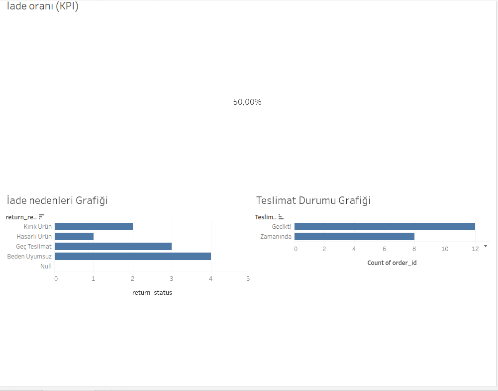

# 📊 E-Ticaret İade Analizi – Business Analyst Case Study

## 📌 Proje Özeti

Bu proje, bir e-ticaret sisteminde artan iade oranlarının analiz edilmesi ve iş kararlarını destekleyecek içgörülerin üretilmesi amacıyla hazırlanmıştır.

Çalışma kapsamında uçtan uca Business Analysis süreci uygulanmıştır.

---

## 🎯 Problem Tanımı

Şirketin mevcut sisteminde:

- İade oranları artmaktadır
- İade nedenleri yeterince analiz edilmemektedir
- Karar vericiler için anlamlı raporlama bulunmamaktadır

Bu durum müşteri memnuniyetsizliği ve operasyonel maliyet artışına yol açmaktadır.

---

## 🎯 Proje Amacı

- İade oranını ölçmek
- İade nedenlerini analiz etmek
- Operasyonel problemleri tespit etmek
- Karar destek dashboard’u oluşturmak

---

## 🧩 Kapsam

Bu proje aşağıdaki BA deliverable’larını içermektedir:

- Business Problem Definition
- Stakeholder Analysis
- As-Is / To-Be Süreç Analizi
- Functional Requirements
- User Stories
- Test Senaryoları
- Dashboard & Data Analizi

---

## 🛠 Kullanılan Araçlar

- Tableau (Dashboard)
- SQL (Data mantığı)
- GitHub (Dokümantasyon)
- Markdown (Doküman yazımı)

---

## 📊 Dashboard

---

## 📌 Insights

- Toplam iade oranı: **%50**
- En yaygın iade nedeni: **beden uyumsuzluğu**
- Teslimat gecikmeleri ile iade arasında ilişki gözlemlenmiştir
- Belirli ürün gruplarında iade oranı daha yüksektir

---

## 🧠 İş Analizi Yaklaşımı

Bu projede:

- İş problemi analiz edilmiş
- Gereksinimler netleştirilmiş
- Veri üzerinden içgörüler üretilmiş
- Teknik ve iş ekipleri arasında köprü kurulmuştur

---

## 🚀 Katkı Sağlanan Yetkinlikler

- Analitik düşünme
- Problem çözme
- Veri analizi
- İş süreçlerini modelleme
- Dashboard tasarımı

---

## 👤 Yazar

**Neslişah Ebral Durdu**  
Business Analyst | Data & BI Developer
